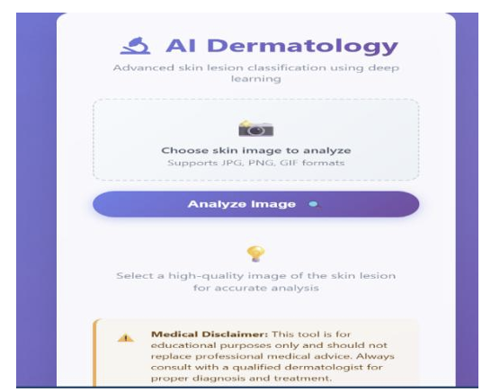
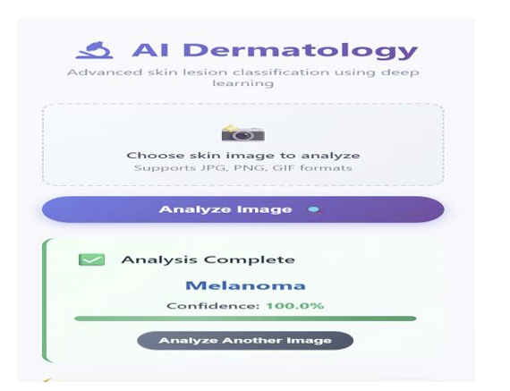
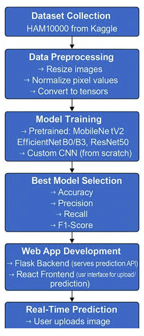
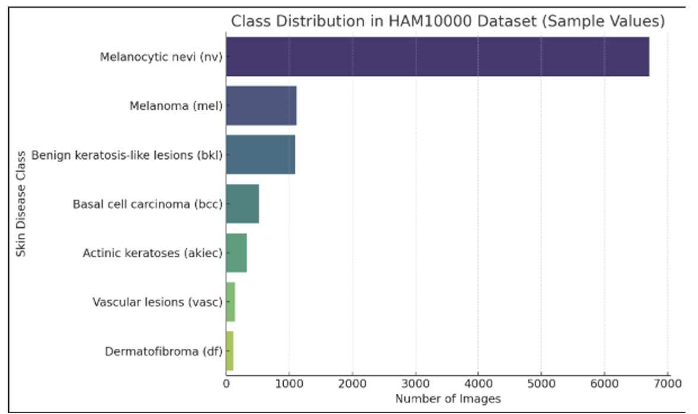
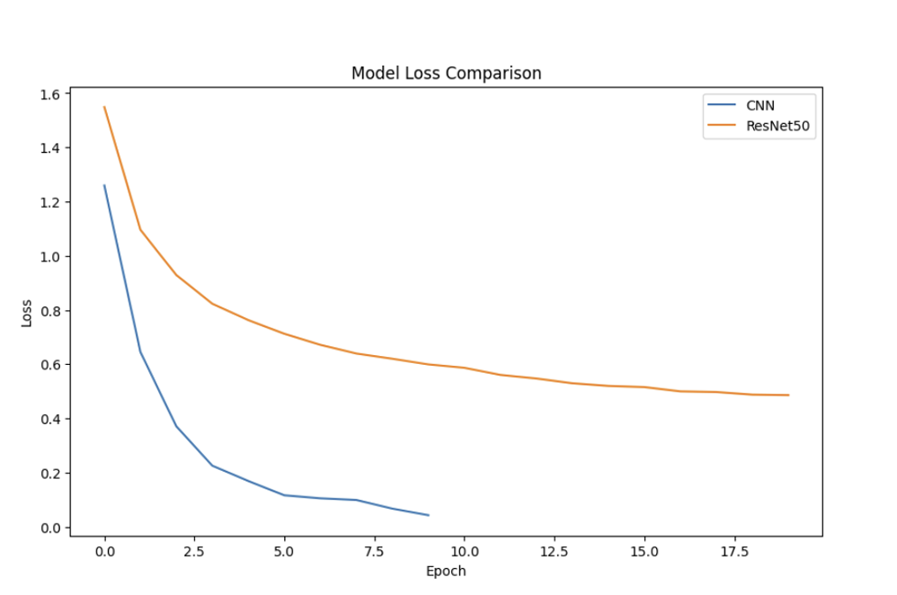
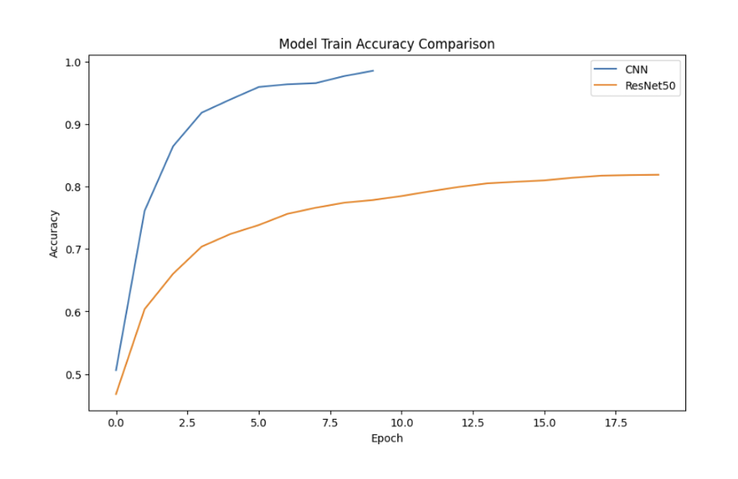
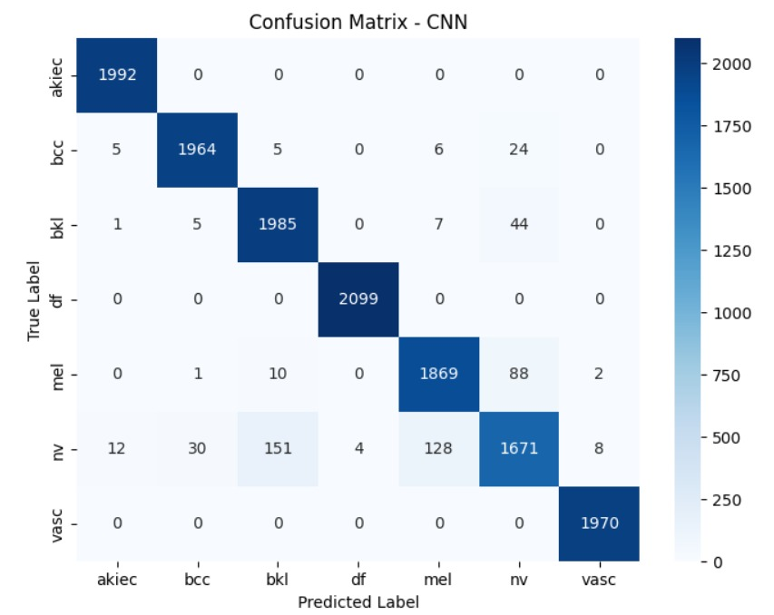
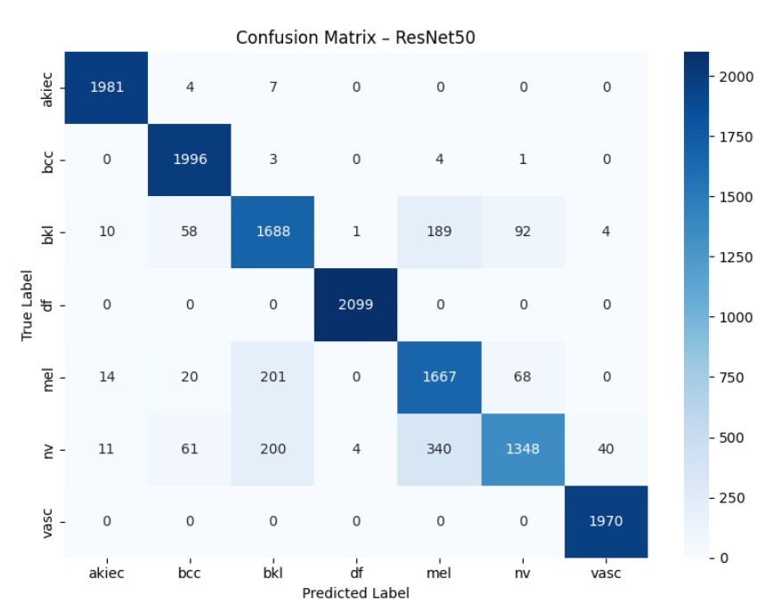

# Real-Time Skin Disease Classification Web App (CNN)

A real-time skin lesion classification system using **deep learning (CNN)**, deployed as a **web application** with a **Flask backend** and **React frontend**. The model is trained on the **HAM10000** dataset (7 classes) and outputs a predicted class with a confidence score.

> **Availability:** Dataset and full implementation code are available **upon reasonable request**.

---

## Highlights
- Multi-class skin lesion classification (HAM10000)
- Model comparison (Custom CNN vs ResNet50)
- Web UI for image upload + prediction result with confidence
- Includes an inference-only demo script (no model weights in public repo)

---

## Repository Structure
- `assets/ui/` — UI screenshots  
- `assets/figures/` — pipeline + dataset figures  
- `assets/results/` — training curves + confusion matrices  
- `docs/` — short methodology notes  
- `src/` — safe demo code (no dataset, no weights)  

---

## UI (Screenshots)



---

## Workflow / Pipeline


---

## Dataset


---

## Results (Snapshots)





---

## Demo (Inference-only, No Model Weights)
This demo shows the inference pipeline (load image → preprocess → output).  
Trained model weights are **not included** in the public repository.

```bash
pip install numpy pillow
python src/demo_inference.py --image path/to/image.jpg
```
After running, it prints a placeholder predicted label and confidence in the terminal.
(Replace the placeholder with your real model later if you decide to publish weights.)

Documentation

Methodology notes: docs/methodology.md

Availability (Data + Full Code)

Due to data-sharing restrictions, the dataset and full source code are available upon reasonable request for academic/research use.
Contact: rifata562@gmail.com
